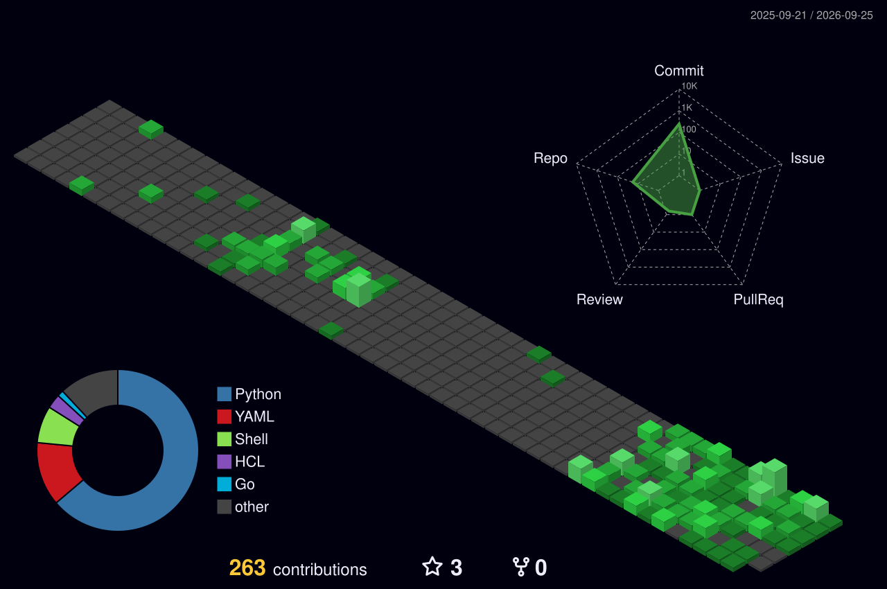

### `$ whoami` 👋

<!--
**letsgologan/letsgologan** is a ✨ _special_ ✨ repository because its `README.md` (this file) appears on your GitHub profile.
-->

### `$ cat about.md` 📄

Linux sysadmin and Infrastructure as Code engineer. I automate and harden RHEL-based systems, turning manual ops workflows into idempotent, version-controlled Ansible playbooks.

### `$ dnf list installed` 🛠️

### `$ finger phong` 📡

